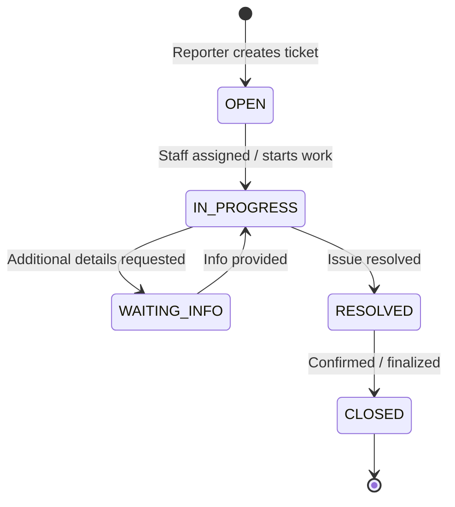

# Faculty Issue Reporting System - Database

Database implementation for the **Faculty Issue Reporting System**, an issue tracking and facility management platform designed for a single academic faculty. It allows students, faculty members, and personnel to report and track issues such as Wi-Fi/Internet disruptions, hardware/software faults, projector/audiovisual failures, classroom facility damages, and building maintenance requests.

## Workflow Lifecycle

Tickets follow a standardized issue resolution lifecycle:



---

## Technology Stack

- **Language / Runtime**: TypeScript, Node.js (via pnpm)
- **Database Engine**: PostgreSQL 18 (Alpine)
- **ORM & Migrations**: Drizzle ORM, Drizzle Kit
- **Containerization**: Docker Compose
- **Package Manager**: pnpm

---

## Repository Structure

```text
pf-db/
├── _entrypoint/
│   └── init.sh             # PostgreSQL initialization script
├── .vscode/                # Editor settings
├── db/
│   ├── migration/          # Drizzle migration files and metadata
│   ├── client.ts           # PostgreSQL & Drizzle client initialization
│   ├── prototype.ts        # Database seed script with sample data
│   ├── schema.dbml         # DBML schema definition for dbdiagram.io
│   ├── schema.ts           # Drizzle schema (enums, tables, relations, indexes)
│   └── utils.ts            # Connection string & ticket number generation utility
├── node_modules/
├── .env.example            # Example environment variables (placeholders only)
├── .gitignore
├── docker-compose.yml      # PostgreSQL Docker Compose service definition
├── drizzle.config.ts       # Drizzle Kit configuration
├── package.json            # Project manifest and npm scripts
├── pnpm-lock.yaml          # pnpm lockfile
├── pnpm-workspace.yaml     # pnpm workspace config
├── README.md               # Documentation
└── tsconfig.json           # TypeScript configuration
```

---

## Database Schema Overview

The database uses **UUID** primary keys with `gen_random_uuid()`, snake_case table and column names in PostgreSQL, and timestamps with time zone.

### PostgreSQL Enums

1. **`user_role`**: `REPORTER`, `STAFF`, `ADMIN`
2. **`ticket_status`**: `OPEN`, `IN_PROGRESS`, `WAITING_INFO`, `RESOLVED`, `CLOSED`
3. **`ticket_priority`**: `LOW`, `MEDIUM`, `HIGH`, `URGENT`
4. **`ticket_event_type`**: `TICKET_CREATED`, `STATUS_CHANGED`, `ASSIGNED`, `UNASSIGNED`, `PRIORITY_CHANGED`, `CATEGORY_CHANGED`, `TEAM_CHANGED`, `COMMENT_ADDED`, `ATTACHMENT_ADDED`, `FEEDBACK_SUBMITTED`, `TICKET_CLOSED`

### Tables

| Table | Primary Key | Description | Key Foreign Keys & Constraints |
|---|---|---|---|
| `teams` | `id` (UUID) | Support and maintenance departments (IT, Facility, AV) | `name` UNIQUE |
| `users` | `id` (UUID) | System users supporting Google OAuth and Email/Password | `google_id` UNIQUE (nullable), `email` UNIQUE, `password_hash` (nullable), `team_id` -> `teams(id)` (ON DELETE SET NULL), CHECK (`google_id IS NOT NULL OR password_hash IS NOT NULL`) |
| `categories` | `id` (UUID) | Ticket categories with default routing team | `name` UNIQUE, `default_team_id` -> `teams(id)` (ON DELETE SET NULL) |
| `locations` | `id` (UUID) | Campus buildings, floors, rooms, and coordinates | Coordinates stored as decimal(10, 7) |
| `tickets` | `id` (UUID) | Issue reports with status and assignments | `ticket_number` UNIQUE (`FAC-YYYY-0001`), foreign keys to reporter, assignee, team, category, location |
| `ticket_comments` | `id` (UUID) | Conversation history on tickets | `ticket_id` (ON DELETE CASCADE), `user_id` (ON DELETE RESTRICT) |
| `ticket_attachments`| `id` (UUID) | Metadata and URLs for uploaded files/images | `ticket_id` (ON DELETE CASCADE), `uploaded_by_id` (ON DELETE RESTRICT) |
| `ticket_events` | `id` (UUID) | Audit log of all changes and lifecycle events | `ticket_id` (ON DELETE CASCADE), `actor_id` (ON DELETE RESTRICT) |
| `feedback` | `id` (UUID) | User ratings and satisfaction comments | `ticket_id` UNIQUE (ON DELETE CASCADE), CHECK (`rating >= 1 AND rating <= 5`) |

### Authentication Design

The `users` table accommodates both modern OAuth and traditional credential-based workflows:
- **Google OAuth Users**: `google_id` is populated; `password_hash` is NULL.
- **Email/Password Users**: `password_hash` is populated; `google_id` is NULL.
- **Linked Accounts**: Both `google_id` and `password_hash` may be set for the same user.
- **Enforced Constraint**: `users_auth_method_check` guarantees `google_id IS NOT NULL OR password_hash IS NOT NULL`.
- **Security & Hashes**: `password_hash` stores standard bcrypt hashes only (generated upstream by the application backend). The database never performs password hashing directly and never stores plaintext passwords.
- **Externalized Secrets**: JWT tokens, OAuth access tokens, OAuth refresh tokens, and client secrets are handled externally by auth services and are never stored in the database.

### DBML Visualization

A DBML file compatible with [dbdiagram.io](https://dbdiagram.io) is provided at [db/schema.dbml](file:///C:/Users/o/Desktop/pf-db/db/schema.dbml).

---

## Getting Started

### 1. Environment Configuration

Copy `.env.example` to `.env` and set your credentials:

```bash
cp .env.example .env
```

> **Note**: Never commit `.env` or reveal credentials in version control.

### 2. Line Endings (Windows)

If developing on Windows, ensure bash scripts inside `_entrypoint/` have LF line endings:

```bash
pnpm run eol
```

### 3. Start PostgreSQL with Docker Compose

Start the database container using Docker Compose:

```bash
docker compose up -d
```

To stop the container:

```bash
docker compose down
```

---

## Migrations & Database Operations

The repository uses **Drizzle ORM** and **Drizzle Kit** to manage schema migrations:

### Generate Migrations
Inspects `db/schema.ts` and creates SQL migration files in `db/migration/`:

```bash
pnpm run db:generate
```

### Apply Migrations
Executes pending SQL migrations against the configured PostgreSQL database:

```bash
pnpm run db:migrate
```

### Direct Push (Development only)
Directly pushes schema changes to PostgreSQL without creating migration files:

```bash
pnpm run db:push
```

### Seed Prototype Data
Populates the database with realistic initial data (3 teams, 5 categories, 5 locations, 5 users with roles, 3 sample tickets, comments, attachment metadata, audit events, and feedback). The seed script is idempotent and safe to rerun:

```bash
pnpm run db:prototype
```

### TypeScript Type-Check & Build
Compiles TypeScript files and validates types across the codebase:

```bash
pnpm run build
```
